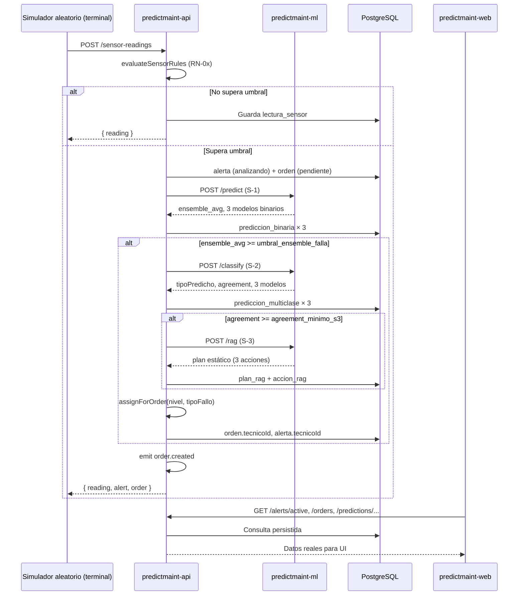

# PredictMaint — Flujo de Monitoreo en Tiempo Real

> Guía para completar y operar el pipeline **S-1 → S-2 → S-3 → asignación de técnico → historial**.
> Complementa `DOCUMENTACION_ARQUITECTURA.md`, `DOCUMENTACION_API_CONTRATO.md` y
> `DOCUMENTACION_MODELO_DE_DATOS.md` §6.1. Fecha: 2026-06-18.

---

## 1. Resumen

> **Importante:** no hay sensores físicos ni IoT en este proyecto. Todo el monitoreo es **100 % simulado**
> desde la **terminal** con un script Python. No se requiere n8n ni hardware externo.

El monitoreo en tiempo real **no es un cron ni un WebSocket**: es un **pipeline por evento**.
Un **simulador aleatorio** elige filas del CSV y las envía a la API cada pocos segundos.
Cada lectura simulada que supera una regla (`RN-01..RN-04`) dispara en el backend:

1. Crea **alerta** + **orden** (sin técnico aún).
2. Ejecuta **S-1** (3 modelos binarios) vía `predictmaint-ml`.
3. Si predice falla → **S-2** (3 modelos multiclase).
4. Si el agreement es suficiente → **S-3** (plan RAG estático por ahora).
5. Asigna un **técnico disponible** según nivel de riesgo y tipo de fallo.
6. Persiste todo en PostgreSQL para que el frontend muestre Monitoreo, Análisis (3 tabs) e Historial con **datos persistidos de la simulación** (no datos mock del frontend).

El dataset `ai4i2020.csv` se usa de dos formas:

| Uso | Cuándo |
|-----|--------|
| **Entrenamiento** | Una vez, con `predictmaint-ml/train.py` |
| **Simulación aleatoria** | En runtime, el script toma filas al azar y las envía a `POST /sensor-readings` |

La aleatoriedad hace que cada demo sea distinta: distintas máquinas, tipos de fallo, niveles de riesgo y técnicos asignados.

---

## 2. Estado actual del código

| Componente | Ubicación | Estado |
|------------|-----------|--------|
| Pipeline completo | `predictmaint-api/src/sensor-readings/sensor-readings.service.ts` | ✅ Implementado |
| Reglas de sensor RN-01..04 | `predictmaint-api/src/common/utils/sensor-rules.util.ts` | ✅ Implementado |
| Cliente ML (S-1/S-2/S-3) | `predictmaint-api/src/ml-gateway/ml-gateway.service.ts` | ✅ Implementado |
| Inferencia binaria/multiclase | `predictmaint-ml/main.py` | ✅ Implementado |
| Recomendaciones estáticas (RAG base) | `predictmaint-ml/rag.py` | ✅ Implementado (mapa fijo por tipo) |
| Asignación de técnico | `predictmaint-api/src/technicians/technicians.service.ts` | ✅ Parcial (ver §8) |
| Vista Monitoreo | `predictmaint-web/src/components/dashboard/monitoring-view.tsx` | ✅ Conectada a API |
| Vista Análisis (3 tabs) | `predictmaint-web/src/components/dashboard/analysis-view.tsx` | ✅ Conectada a API |
| Vista Historial | `predictmaint-web/src/components/dashboard/orders-history-view.tsx` | ✅ Conectada a API |
| Simulador aleatorio (terminal) | `scripts/simulate-sensor-stream.py` | ❌ Pendiente (script en §6.3) |
| Tabs bloqueados por etapa S-1/S-2 | `analysis-view.tsx` | ❌ Pendiente (hoy todos son clicables) |
| Filtro de técnico por turno actual | `technicians.service.ts` | ❌ Pendiente |

---

## 3. Diagrama del flujo



---

## 4. Pipeline interno (detalle)

Implementado en `SensorReadingsService.create()`:

### 4.1 Entrada — `POST /sensor-readings`

**Body (`CreateSensorReadingDto`):**

```json
{
  "maquinaId": "M-001",
  "tipo": "H",
  "airTemperature": 298.5,
  "processTemperature": 309.1,
  "rotationalSpeed": 1240,
  "torque": 42.8,
  "toolWear": 185,
  "capturadoEn": "2026-06-18T10:00:00Z"
}
```

- `power_w` lo calcula el backend: `torque × rpm × 2π / 60`.
- `maquinaId` debe existir en tabla `maquina` (seed: `M-001`..`M-005`).
- Este endpoint **no requiere JWT** hoy (pensado para ingestión de sensores/simulador).

### 4.2 Reglas de disparo (`evaluateSensorRules`)

Se evalúan **en orden**; la primera que coincide gana:

| Regla | Condición | Tipo asociado |
|-------|-----------|---------------|
| **RN-01** | `(processTemp - airTemp) > 8.6` **o** `rotationalSpeed < 1380` | HDF |
| **RN-02** | `power_w < 3500` **o** `power_w > 9000` | PWF |
| **RN-03** | `toolWear >= 200` | TWF |
| **RN-04** | `torque × toolWear > 5000` | OSF |

Si ninguna regla se dispara → solo se guarda la lectura, **sin alerta ni orden**.

> **Nota:** Una fila del CSV puede cumplir varias reglas; el backend usa la primera (RN-01 tiene prioridad).

### 4.3 Etapa S-1 — Predicción binaria

- Llama a `predictmaint-ml` → `POST /predict`.
- Modelos: Regresión Logística, Random Forest, XGBoost.
- Persiste 3 filas en `prediccion_binaria`.
- Calcula `ensemble_avg` (promedio de probabilidades de falla).
- Actualiza `alerta.ensembleAvg`, `alerta.nivel`, `orden.ensembleAvg`, `orden.nivelRiesgo`.
- Estado alerta: `analizando` → `clasificando`.

**Umbral de falla:** clave `umbral_ensemble_falla` en tabla `configuracion` (default **0.50**, seed en `20260617000008-seed-configuracion.js`).

### 4.4 Etapa S-2 — Clasificación multiclase

Solo si `ensemble_avg >= umbral_ensemble_falla`:

- Llama a `POST /classify`.
- Modelos: Decision Tree, LightGBM, SVM.
- Persiste 3 filas en `prediccion_multiclase`.
- `tipo_fallo` final = tipo del modelo líder (LightGBM).
- `agreement`: ALTO (3/3), MEDIO (2/3), BAJO (1/3).
- Registra evento `clasificacion_s2` en `evento_orden`.

### 4.5 Etapa S-3 — Recomendaciones (estáticas por ahora)

Solo si `agreement >= agreement_minimo_s3` (default **MEDIO**):

- Llama a `POST /rag` con `{ tipoFallo, maquinaId, historial: [] }`.
- `predictmaint-ml/rag.py` devuelve **3 acciones fijas** por tipo (HDF/PWF/TWF/OSF).
- RNF → solo inspección manual, sin plan automático completo.
- Persiste `plan_rag`, `accion_rag`, `plan_rag_fuente`.
- Registra evento `rag_s3`.

> Más adelante reemplazarás `rag.py` por recuperación real de fuentes + LLM; el contrato HTTP `/rag` ya está listo.

### 4.6 Asignación de técnico y orden

Tras S-2 (si hubo falla), siempre se intenta asignar técnico vía `TechniciansService.assignForOrder()`:

| Nivel de riesgo | Criterio |
|-----------------|----------|
| **CRITICAL** | Técnico **disponible** con mayor `nivelExperiencia` |
| **HIGH** | Técnico **disponible** cuya **especialidad** coincide con el tipo de fallo |
| **MEDIUM / LOW** | Técnico **disponible** con **menor carga** de órdenes activas |

**Mapa especialidad ↔ tipo de fallo** (en código):

| Tipo | Especialidad buscada |
|------|----------------------|
| HDF | hidraulico |
| PWF | electrico |
| TWF | mecanico |
| OSF | mecanico |
| RNF | general |

Si encuentra candidato → `tecnico.estado = en_intervencion`, se vincula a `orden` y `alerta`.
Emite evento `order.created` (notificaciones stub).

**Técnicos seed** (`20260617000011-seed-demo-data.js`):

| ID | Nombre | Especialidad | Turno |
|----|--------|--------------|-------|
| 1 | Henry Orbegoso | mecanico | mañana |
| 2 | Carlos Mendoza | electrico | tarde |
| 3 | Luis Torres | general | noche |

---

## 5. Integración con `ai4i2020.csv`

### 5.1 Columnas del CSV → campos de la API

| Columna CSV | Campo API | Notas |
|-------------|-----------|-------|
| `Type` | `tipo` | `L`, `M` o `H` |
| `Air temperature [K]` | `airTemperature` | Kelvin |
| `Process temperature [K]` | `processTemperature` | Kelvin |
| `Rotational speed [rpm]` | `rotationalSpeed` | entero |
| `Torque [Nm]` | `torque` | float |
| `Tool wear [min]` | `toolWear` | entero |
| `HDF/PWF/TWF/OSF/RNF` | *(no se envían)* | Etiquetas de entrenamiento; el ML las infiere |

### 5.2 Entrenamiento (una sola vez)

```powershell
cd predictmaint-ml
python -m venv .venv
.\.venv\Scripts\Activate.ps1
pip install -r requirements.txt
python train.py
uvicorn main:app --reload --port 8000
```

Verifica: `GET http://localhost:8000/health` → `{ "status": "ok", "modelosCargados": 7 }`.

### 5.3 Filas de ejemplo que disparan el pipeline

Filas reales del CSV (índice 1-based + header) útiles para pruebas:

| Tipo real | Fila CSV | Type | Valores clave | Regla que dispara |
|-----------|----------|------|---------------|-------------------|
| HDF | 3238 | M | proc-air ≈ 8.6 K, rpm 1342 | RN-01 |
| PWF | 52 | L | rpm 2861, power ≈ 1378 W | RN-02 (tras RN-01 también cumple temp) |
| TWF | 79 | L | toolWear 208 | RN-03 |
| OSF | 71 | L | torque×wear ≈ 12549 | RN-04 (también RN-01 y RN-02) |

**Importante:** en la simulación aleatoria, cada fila se asigna a una máquina seed (`M-001`..`M-005`)
**elegida al azar**, para ver alertas variadas en Monitoreo e Historial.

### 5.4 Lectura manual (curl)

Tras login en el frontend, el simulador **no necesita JWT**. Ejemplo HDF en M-001:

```powershell
curl -X POST http://localhost:3001/sensor-readings `
  -H "Content-Type: application/json" `
  -d "{\"maquinaId\":\"M-001\",\"tipo\":\"M\",\"airTemperature\":300.8,\"processTemperature\":309.4,\"rotationalSpeed\":1342,\"torque\":62.4,\"toolWear\":113,\"capturadoEn\":\"2026-06-18T10:00:00Z\"}"
```

Respuesta esperada (resumida):

```json
{
  "reading": { "id": 6, "maquinaId": "M-001", "powerW": 8769.3, ... },
  "alert": { "id": "ALT-001", "estado": "pendiente", "nivel": "HIGH", "ensembleAvg": 0.87, ... },
  "order": { "id": "ORD-001", "estado": "pendiente", "tipoFallo": "HDF", "tecnicoId": 1, ... }
}
```

---

## 6. Simulación aleatoria desde la terminal

### 6.1 Concepto

La simulación **no usa sensores reales ni n8n**. Solo hace falta un script en la terminal que:

1. **Precarga** del CSV todas las filas que dispararían alguna regla RN-0x.
2. En cada ciclo, elige **al azar** una fila y una máquina (`M-001`..`M-005`).
3. Envía `POST /sensor-readings` a la API.
4. Espera un intervalo **aleatorio** (p. ej. entre 10 y 15 min) antes del siguiente envío.

Así el Monitoreo se comporta como “en vivo”: alertas y órdenes aparecen de forma impredecible,
con distintos tipos de fallo, niveles de riesgo y técnicos asignados.

```
ai4i2020.csv  →  [pool de filas con regla RN-0x]  →  random.choice()  →  POST /sensor-readings
                                                              ↓
                                                    pipeline S-1 → S-2 → S-3
                                                              ↓
                                                    Monitoreo / Análisis / Historial
```

### 6.2 ¿Por qué aleatorio y no secuencial?

| Modo | Comportamiento | Uso |
|------|----------------|-----|
| **Secuencial** | Fila 1, 2, 3… del CSV | Depuración, reproducir un caso fijo |
| **Aleatorio** (recomendado) | Fila y máquina distintas cada vez | Demo, monitoreo “en vivo”, historial variado |

Para la entrega del proyecto y las pruebas en clase, usa **modo aleatorio** por defecto.

### 6.3 Script de referencia (Python)

Guardar como `scripts/simulate-sensor-stream.py` en la raíz del monorepo:

```python
"""Simula monitoreo en tiempo real con lecturas ALEATORIAS desde ai4i2020.csv."""

import argparse
import csv
import json
import math
import random
import time
import urllib.request
from datetime import datetime, timezone
from pathlib import Path

API_URL = "http://localhost:3001/sensor-readings"
CSV_PATH = Path(__file__).resolve().parent.parent / "ai4i2020.csv"
MACHINE_IDS = ["M-001", "M-002", "M-003", "M-004", "M-005"]


def triggers_rule(air, proc, rpm, torque, wear):
    diff = proc - air
    power = torque * rpm * 2 * math.pi / 60
    if diff > 8.6 or rpm < 1380:
        return True
    if power < 3500 or power > 9000:
        return True
    if wear >= 200:
        return True
    if torque * wear > 5000:
        return True
    return False


def load_trigger_pool(csv_path: Path) -> list[dict]:
    pool = []
    with csv_path.open(newline="", encoding="utf-8") as f:
        for row in csv.DictReader(f):
            air = float(row["Air temperature [K]"])
            proc = float(row["Process temperature [K]"])
            rpm = int(float(row["Rotational speed [rpm]"]))
            torque = float(row["Torque [Nm]"])
            wear = int(float(row["Tool wear [min]"]))
            if triggers_rule(air, proc, rpm, torque, wear):
                pool.append(
                    {
                        "tipo": row["Type"].strip(),
                        "airTemperature": air,
                        "processTemperature": proc,
                        "rotationalSpeed": rpm,
                        "torque": torque,
                        "toolWear": wear,
                    }
                )
    return pool


def post_reading(payload):
    req = urllib.request.Request(
        API_URL,
        data=json.dumps(payload).encode(),
        headers={"Content-Type": "application/json"},
        method="POST",
    )
    with urllib.request.urlopen(req, timeout=60) as resp:
        return json.loads(resp.read())


def main():
    parser = argparse.ArgumentParser(description="Simulador aleatorio de lecturas de sensor")
    parser.add_argument("--max", type=int, default=20, help="Cantidad de lecturas a enviar (0 = infinito)")
    parser.add_argument("--min-delay", type=float, default=2.0, help="Segundos mínimos entre envíos")
    parser.add_argument("--max-delay", type=float, default=8.0, help="Segundos máximos entre envíos")
    parser.add_argument("--seed", type=int, default=None, help="Semilla para reproducir la misma secuencia")
    args = parser.parse_args()

    if args.seed is not None:
        random.seed(args.seed)

    pool = load_trigger_pool(CSV_PATH)
    if not pool:
        raise SystemExit("No hay filas en el CSV que disparen reglas RN-0x")

    print(f"Pool: {len(pool)} filas candidatas · modo ALEATORIO · máquinas {MACHINE_IDS}")

    sent = 0
    while args.max == 0 or sent < args.max:
        row = random.choice(pool)
        maquina_id = random.choice(MACHINE_IDS)
        payload = {
            "maquinaId": maquina_id,
            **row,
            "capturadoEn": datetime.now(timezone.utc).isoformat(),
        }
        result = post_reading(payload)
        order = result.get("order") or {}
        alert = result.get("alert") or {}
        print(
            f"[{sent + 1}] {maquina_id} tipo={row['tipo']} "
            f"orden={order.get('id', '—')} alerta={alert.get('id', '—')} "
            f"nivel={order.get('nivelRiesgo', '—')} fallo={order.get('tipoFallo', '—')}"
        )
        sent += 1
        if args.max == 0 or sent < args.max:
            delay = random.uniform(args.min_delay, args.max_delay)
            time.sleep(delay)


if __name__ == "__main__":
    main()
```

### 6.4 Ejecución

```powershell
# API + ML + PostgreSQL ya levantados en otras terminales

# Demo estándar: 20 lecturas aleatorias, pausa 10–15 min entre cada una
python scripts/simulate-sensor-stream.py

# Demo larga: 50 lecturas
python scripts/simulate-sensor-stream.py --max 50

# Stream continuo (Ctrl+C para detener)
python scripts/simulate-sensor-stream.py --max 0

# Misma secuencia “aleatoria” reproducible (útil para depurar)
python scripts/simulate-sensor-stream.py --seed 42

# Lecturas más rápidas
python scripts/simulate-sensor-stream.py --min-delay 1 --max-delay 3
```

### 6.5 ¿Hace falta n8n?

**No.** n8n añadiría otro servicio sin beneficio claro para este flujo. El script de terminal
cubre simulación aleatoria, intervalos variables y envío a la API. Reserva n8n solo si más adelante
quieres orquestar notificaciones externas (Slack, email) sin escribir código.

### 6.6 Polling en el frontend (Monitoreo “en vivo”)

La vista `/dashboard/monitoring` usa SWR con revalidación implícita al enfocar la pestaña.
Para refresco automático cada N segundos, añadir en `useActiveAlerts` / `useMachines`:

```typescript
useSWR('/alerts/active', () => alertService.findActive(), { refreshInterval: 5000 });
```

Con eso, cada lectura simulada aparecerá en Monitoreo sin recargar manualmente.

---

## 7. Mapeo a las vistas del frontend

### 7.1 Monitoreo — `/dashboard/monitoring`

| Elemento UI | Endpoint | Comportamiento |
|-------------|----------|----------------|
| KPIs (críticas, moderadas, OK) | `GET /alerts/active`, `GET /machines` | Cuenta alertas por `nivel` |
| Tarjeta por máquina | `GET /machines` + alertas activas | Muestra estado del flujo |
| Botón **Ver análisis →** | Navega a `/dashboard/analysis/[machineId]` | Usa última orden de esa máquina |
| Alertas activas | `GET /alerts/active` | Muestra `ensemble_avg`, técnico, enlace a orden |
| Próximo envío CSV | `GET /notifications/next-dispatch` | Horario Config 2 |

### 7.2 Análisis de máquina — `/dashboard/analysis/[machineId]`

La vista obtiene la **orden más reciente** de la máquina (`GET /orders?maquinaId=...`)
y carga los resultados persistidos del pipeline:

| Tab | Endpoint | Cuándo debe mostrarse |
|-----|----------|------------------------|
| **1 Predicción (S-1)** | `GET /predictions/binary/:orderId` | Siempre (hay orden) |
| **2 Clasificación (S-2)** | `GET /predictions/multiclass/:orderId` | Solo si S-1 predijo FALLA (`ensemble_avg ≥ umbral`) |
| **3 Recomendaciones (S-3)** | `GET /rag/plan/:orderId` | Solo si S-2 corrió y `agreement ≥ mínimo` |

**Comportamiento deseado (pendiente de implementar en UI):**

```typescript
const s1Fail = (binary.data?.ensembleAvg ?? 0) >= 0.5; // o umbral de config
const s2Ready = s1Fail && (multiclass.data?.items?.length ?? 0) > 0;
const s3Ready = s2Ready && (rag.data?.acciones?.length ?? 0) > 0;

// Deshabilitar tab 2 si !s1Fail, tab 3 si !s3Ready
// Auto-avanzar: tras cargar S-1 con falla → setTab('s2'); tras S-2 → setTab('s3')
```

Hoy los tres tabs son clicables; los datos vacíos en tab 2/3 indican que esa etapa no corrió.

### 7.3 Historial — `/dashboard/orders`

| Elemento | Endpoint |
|----------|----------|
| Tabla de órdenes | `GET /orders?page=&limit=&estado=&maquinaId=&tipoFallo=` |
| KPIs del historial | Derivados del listado (total, pendientes, finalizadas) |
| Detalle | `/dashboard/orders/[id]` → `GET /orders/:id`, `/timeline`, `/rag/plan/:orderId` |

Cada lectura simulada que complete el pipeline genera una fila **real** en Historial
con `tipoFallo`, `nivelRiesgo`, `tecnicoId`, `ensembleAvg` y fechas de detección.

---

## 8. Trabajo pendiente para cerrar el flujo al 100%

### 8.1 Frontend — tabs condicionales y auto-navegación

**Archivo:** `predictmaint-web/src/components/dashboard/analysis-view.tsx`

- [ ] Deshabilitar tab 2 si no hay predicciones multiclase.
- [ ] Deshabilitar tab 3 si no hay `plan_rag`.
- [ ] Auto-seleccionar tab 2 cuando S-1 consenso = FALLA.
- [ ] Auto-seleccionar tab 3 cuando exista plan RAG.
- [ ] Mostrar lectura del sensor de la orden (`GET /sensor-readings` o incluir en `GET /orders/:id`).

### 8.2 Backend — asignación por turno

**Archivo:** `predictmaint-api/src/technicians/technicians.service.ts`

Hoy `findAvailable()` no filtra por **turno actual** ni por `fuera_de_turno`.
Según el modelo de datos §4.4, el criterio debería incluir:

- [ ] Determinar turno activo según hora local (mañana 06–14, tarde 14–22, noche 22–06).
- [ ] Filtrar técnicos cuyo `turno` coincida **o** estén en turno cruzado configurado.
- [ ] Excluir `estado = fuera_de_turno`.

### 8.3 Técnico hidráulico para HDF

El mapa asigna HDF → `hidraulico`, pero el seed solo tiene mecanico/electrico/general.
Para pruebas realistas de HDF:

- [ ] Añadir técnico hidráulico en seeder, **o**
- [ ] Cambiar fallback: si no hay hidráulico, usar mecanico (como ya hace HIGH con lista vacía → todos).

### 8.4 Simulador aleatorio y refresh

- [ ] Crear `scripts/simulate-sensor-stream.py` con modo aleatorio (código en §6.3).
- [ ] Añadir `refreshInterval` en hooks de Monitoreo para ver llegar alertas sin recargar.

### 8.5 RAG dinámico (fase posterior)

- [ ] Reemplazar mapa estático en `rag.py` por recuperación de `fuente_rag` + LLM.
- [ ] El contrato `POST /rag` y tablas `plan_rag`/`accion_rag` **no cambian**.

---

## 9. Checklist para levantar y probar end-to-end

### 9.1 Servicios

```powershell
# 1. PostgreSQL corriendo; .env de predictmaint-api configurado
cd predictmaint-api
npm run start:dev

# 2. Modelos entrenados y API ML
cd predictmaint-ml
python train.py
uvicorn main:app --reload --port 8000

# 3. Frontend
cd predictmaint-web
npm run dev
```

### 9.2 Variables críticas

| Servicio | Variable | Valor |
|----------|----------|-------|
| predictmaint-api | `ML_SERVICE_URL` | `http://localhost:8000` |
| predictmaint-api | `ML_API_KEY` | `ml-secret-key` |
| predictmaint-ml | `API_KEY` | `ml-secret-key` (debe coincidir) |
| predictmaint-api | `DATABASE_SYNC` | `true` (dev) |
| predictmaint-api | `DATABASE_SEED` | `true` (primera vez) |
| predictmaint-web | `NEXT_PUBLIC_API_URL` | `http://localhost:3001` |

### 9.3 Secuencia de prueba manual

1. Login: `operador@planta.pe` / `password123`.
2. Abrir `/dashboard/monitoring`.
3. Ejecutar el simulador aleatorio: `python scripts/simulate-sensor-stream.py` (§6.4).
4. Verificar en Monitoreo: alertas activas con `ensemble_avg` y nivel.
5. Clic **Ver análisis** en una máquina → tabs S-1/S-2/S-3 con datos de modelos.
6. Abrir `/dashboard/orders` → órdenes nuevas con técnico asignado.
7. Abrir detalle de orden → timeline con eventos `deteccion_s1`, `clasificacion_s2`, `rag_s3`, `respuesta_tecnico`.

### 9.4 Verificación en base de datos

```sql
SELECT id, maquina_id, estado, nivel_riesgo, tipo_fallo_codigo, tecnico_id
FROM orden ORDER BY detectado_en DESC LIMIT 10;

SELECT id, orden_id, maquina_id, estado, ensemble_avg FROM alerta
ORDER BY creado_en DESC LIMIT 10;

SELECT orden_id, modelo, prediccion, probabilidad FROM prediccion_binaria
WHERE orden_id = 'ORD-001';

SELECT orden_id, modelo, tipo_predicho_codigo FROM prediccion_multiclase
WHERE orden_id = 'ORD-001';
```

---

## 10. Troubleshooting

| Síntoma | Causa probable | Solución |
|---------|----------------|----------|
| `{ reading }` sin alert/order | Lectura no supera RN-0x | Usar filas de §5.3 o §6.2 |
| Error 503 en pipeline | ML no levantado o modelos sin entrenar | `python train.py` + uvicorn |
| Error 401 ML | `ML_API_KEY` ≠ `API_KEY` | Unificar en ambos `.env` |
| Tab 2/3 vacíos | S-1 predijo SIN FALLA o agreement bajo | Bajar umbral o usar lectura con fallo claro |
| Sin técnico asignado | Ninguno `disponible` | Resetear estados en BD o crear más técnicos |
| Historial vacío | Pipeline no completó (solo lecturas normales) | Enviar lecturas que disparen reglas |
| Puerto 8000 ocupado | Otro proceso usa el puerto | `uvicorn ... --port 8001` y actualizar `ML_SERVICE_URL` |

---

## 11. Referencias de código

| Responsabilidad | Archivo |
|-----------------|---------|
| Orquestación pipeline | `predictmaint-api/src/sensor-readings/sensor-readings.service.ts` |
| Reglas RN-0x | `predictmaint-api/src/common/utils/sensor-rules.util.ts` |
| Gateway ML | `predictmaint-api/src/ml-gateway/ml-gateway.service.ts` |
| Asignación técnico | `predictmaint-api/src/technicians/technicians.service.ts` |
| Inferencia S-1/S-2 | `predictmaint-ml/main.py` |
| Plan estático S-3 | `predictmaint-ml/rag.py` |
| Entrenamiento | `predictmaint-ml/train.py` |
| Vista Monitoreo | `predictmaint-web/src/components/dashboard/monitoring-view.tsx` |
| Vista Análisis | `predictmaint-web/src/components/dashboard/analysis-view.tsx` |
| Vista Historial | `predictmaint-web/src/components/dashboard/orders-history-view.tsx` |

---

## 12. Orden de implementación recomendado

1. **Verificar pipeline** con 1 lectura curl (§5.4) — confirma API + ML + BD.
2. **Crear simulador aleatorio** (§6.3) — genera volumen variado para Historial.
3. **Refresh automático** en Monitoreo — sensación “tiempo real” mientras corre el script.
4. **Tabs condicionales** en Análisis — UX del flujo S-1 → S-2 → S-3.
5. **Filtro por turno** en asignación — regla de negocio completa.
6. **RAG dinámico** — cuando el motor LLM esté listo.

Con los pasos 1–4 tendrás Monitoreo simulado en vivo (lecturas al azar desde terminal),
Análisis con los 3 tabs poblados e Historial con órdenes persistidas por el pipeline ML.
