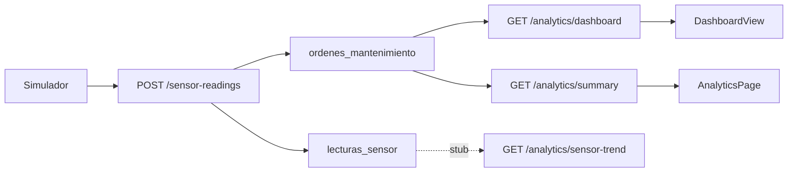

# Guía: Dashboard y Analítica — diseño Figma + datos reales

Documento en **dos partes**:

1. **Parte A (obligatoria primero):** replicar las capturas Figma en la UI.
2. **Parte B:** conectar PostgreSQL, API NestJS y flujo operativo (simulador → ML → órdenes).

**Referencias visuales oficiales:**

| Vista | Captura | Wireframe | Ruta app |
|-------|---------|-----------|----------|
| Dashboard General | `design/captures/02 - Dashboard.png` | `design/code/README.md` §2 | `/dashboard` |
| Analítica y Reportes | `design/captures/07 - Analitica y Reportes.png` | `design/code/README.md` §18 | `/dashboard/analytics` |

**Stack:** `predictmaint-api` (3001) · `predictmaint-web` (3000) · `predictmaint-ml` (8001) · PostgreSQL  
**Última revisión:** junio 2026

---

# Parte A — Paridad visual Figma (hacer primero)

> **Regla:** no cablear analítica con datos reales mientras `/dashboard/analytics` siga siendo `RawJsonView`.  
> En dashboard, la estructura existe pero faltan columnas, sublabels y badges respecto a la captura 02.

## A.1 Principios

1. Comparar **side-by-side** con el PNG al terminar cada bloque.
2. Reutilizar: `Topbar`, `KpiCard`, `Card`, `DataTable`, `Badge`, `StatusPill`, `FAULT_COLORS` / `FAULT_LABELS`.
3. Mantener layout del Figma; si faltan datos, usar `—` o empty state, **no** cambiar la estructura.
4. El sidebar del código actual (Monitoreo, Historial, Técnicos, Analítica) es el válido; no duplicar ítems sueltos del wireframe antiguo (Predicción / Tipo / Recomendaciones como rutas aparte).

### Archivos a tocar (Parte A)

| Acción | Archivo |
|--------|---------|
| Modificar | `predictmaint-web/src/components/dashboard/dashboard-view.tsx` |
| Modificar | `predictmaint-web/src/components/dashboard/dashboard-panels.tsx` |
| Crear | `predictmaint-web/src/components/dashboard/analytics/*.tsx` |
| Reemplazar | `predictmaint-web/src/app/dashboard/analytics/page.tsx` |

---

## A.2 Dashboard — captura `02 - Dashboard.png`

### Layout

```
DashboardPage
├── Sidebar + usuario (nombre + rol)
├── Topbar: "Dashboard General" | fecha | turno | badge "{N} Alertas activas"
├── KpiRow ×4
├── Fila media (3 columnas)
│   ├── Variables de Sensor — Ultimas 24h
│   ├── Tipos de Fallo — Hoy
│   └── Estado de Maquinas
└── Alertas Recientes + "Ver historial completo →"
```

### KPI row — Figma vs código

| # | Captura | Sublabel Figma | Código hoy | Gap |
|---|---------|----------------|------------|-----|
| 1 | **24** Máquinas Monitoreadas | "22 en operacion" | `totalMaquinas` + filter | OK |
| 2 | **7** Fallos Detectados Hoy | **"3 criticos / 4 moderados"** | sublabel genérico | Usar `criticosHoy`, `moderadosHoy` |
| 3 | **3.4%** Tasa de Fallo Global | "Umbral: 5% OK" | `tasaDeteccion` (cobertura) | Recalcular tasa real de fallo |
| 4 | **91.2%** Precisión del Modelo | **"XGBoost activo S-1"** | texto fijo XGBoost | Modelo líder / `es_default` dinámico |

**KPI 2 (ejemplo):**

```tsx
value={d?.fallasDetectadasHoy ?? d?.fallosHoy ?? '—'}
sublabel={`${d?.criticosHoy ?? 0} criticos / ${d?.moderadosHoy ?? 0} moderados`}
```

**KPI 3:** `tasaFalloGlobal = (fallasDetectadasHoy / totalMaquinas) * 100` — comparar visualmente con umbral 5%.

### Variables de Sensor — Ultimas 24h

- Barras azules + eje horas + leyenda Temp Aire / Temp Proceso / RPM / Torque.
- Línea roja **"Umbral fallo"** (`ReferenceLine`).
- Selector de variable (hoy solo RPM).
- Empty state aceptable hasta Parte B; **mantener tamaño y leyenda** como la captura.

### Tipos de Fallo — Hoy

- Filas HDF, PWF, TWF, OSF con barra de color + count (ej. HDF · Heat Dissipation · **3**).
- Datos: `dashboard.fallosPorTipoHoy` (**no** `faults-by-type?range=week`).

### Estado de Maquinas

- M-001…M-005, Tipo H/M/L, badge **FALLO** (rojo) / **NORMAL** (verde) / **ALERTA** (amarillo).
- Derivar cruzando `GET /machines` + `GET /alerts/active`.

### Tabla Alertas Recientes

| Columna captura | Gap en código |
|-----------------|---------------|
| Máquina + Tipo | OK |
| Tipo Fallo `HDF - Heat Dissipation` | Solo código → añadir `FAULT_LABELS` |
| **Algoritmo** (XGBoost, Random Forest) | **Columna ausente** → `modeloPrediccion` |
| Confianza % | Renombrar desde "Confianza S-1" |
| Hora | OK |
| Estado Pendiente / En Progreso / Finalizado | Mapear colores Figma |

### Checklist — Dashboard (02)

- [ ] Topbar: fecha + turno calculado (no hardcoded)
- [ ] Badge alertas activas a la derecha
- [ ] KPI 2: sublabel criticos/moderados
- [ ] KPI 3: tasa fallo + umbral 5%
- [ ] KPI 4: sublabel modelo activo real
- [ ] Gráfico: leyenda 4 variables + umbral
- [ ] Tipos fallo: counts de **hoy**
- [ ] Máquinas: badges FALLO / NORMAL / ALERTA
- [ ] Tabla: columna **Algoritmo**
- [ ] Comparar con `design/captures/02 - Dashboard.png`

---

## A.3 Analítica — captura `07 - Analitica y Reportes.png`

### Estado vs objetivo

| | Hoy | Captura 07 |
|---|-----|------------|
| UI | `RawJsonView` | Layout completo |
| Componentes | 0 | 6 bloques + tabla |

### Layout

```
AnalyticsPage
├── Topbar + subtítulo "Seguimiento de alertas • Efectividad del sistema • Log de envios CSV automaticos"
├── KpiRow ×4 (alertas semana | RAG | sin atender | CSVs hoy)
├── Fila 2: Alertas sin atender | Fallos por tipo — Semana actual
├── Fila 3: Efectividad del sistema | Maquinas con mas fallos recurrentes
└── Log de mensajes automaticos (tabla ancho completo)
```

### Componentes a crear

| Archivo | Contenido captura |
|---------|-------------------|
| `analytics-kpi-row.tsx` | 4 mini-cards: 18 / 11 / 2 / 6 con colores azul/verde/rojo/naranja |
| `unattended-panel.tsx` | ORD-027 · M-001 · Sin atender: 4 min · Tecnico · badge CRITICAL/HIGH |
| `fault-analytics-panel.tsx` | Barras HDF(8) PWF(5) TWF(3) OSF(2) RNF(0 sin casos) |
| `rag-effectiveness-panel.tsx` | 18 alertas · 11 RAG (61%) · 5 sin RAG (28%) · 2 sin atender (11%) |
| `recurrence-panel.tsx` | M-001 (6 fallos) … barras por máquina, subtítulo "Ultimos 30 dias" |
| `csv-log-table.tsx` | Hora / Tecnico / Maquinas / Motivo / Canal / Estado "Entregado" |

### Composición objetivo (`analytics/page.tsx`)

```tsx
<Topbar title="Analítica y Reportes" subtitle="Seguimiento de alertas • ..." />
<AnalyticsKpiRow />
<div className="grid gap-4 lg:grid-cols-2">
  <UnattendedPanel />
  <FaultAnalyticsPanel />
</div>
<div className="grid gap-4 lg:grid-cols-2">
  <RagEffectivenessPanel />
  <RecurrencePanel />
</div>
<CsvLogTable />
```

### Checklist — Analítica (07)

- [ ] Sin `RawJsonView`
- [ ] Topbar + subtítulo con bullets •
- [ ] 4 KPI cards coloreadas
- [ ] Panel sin atender (lista)
- [ ] 5 tipos de fallo semana (RNF en cero)
- [ ] Efectividad con porcentajes
- [ ] Recurrencia por máquina
- [ ] Tabla log 6 columnas
- [ ] Comparar con `design/captures/07 - Analitica y Reportes.png`

---

## A.4 Orden Parte A

| Paso | Tarea | Captura |
|------|-------|---------|
| A1 | Dashboard: KPIs + tabla Algoritmo + tipos fallo hoy | 02 |
| A2 | Dashboard: badges máquinas + turno + tasa fallo | 02 |
| A3 | Crear 6 componentes analytics | 07 |
| A4 | Reemplazar `analytics/page.tsx` | 07 |
| A5 | Revisión side-by-side PNG | 02 + 07 |

**Tras A5 → continuar Parte B.**

---

# Parte B — Datos reales (después del diseño)

## B.1 Resumen ejecutivo

| Vista | Ruta | UI (post A) | Datos | Completitud datos |
|-------|------|-------------|-------|-------------------|
| Dashboard General | `/dashboard` | Captura 02 | Parcial | ~70 % |
| Analítica y Reportes | `/dashboard/analytics` | Captura 07 | API parcial | ~40 % tras UI |
| Monitoreo (ref.) | `/dashboard/monitoring` | Implementada | Alta | ~90 % |

---

## B.2 Arquitectura de datos



---

## B.3 Requisitos previos

### Servicios

```powershell
cd predictmaint-api; npm run start:dev
cd predictmaint-ml; uvicorn main:app --reload --port 8001
cd predictmaint-web; npm run dev
```

### Generar datos

```powershell
python predictmaint-ml/train.py
python scripts/simulate-sensor-stream.py --stages 3
```

Login: `operador@planta.pe` / `password123`

### SQL verificación

```sql
SELECT COUNT(*) FROM ordenes_mantenimiento WHERE fecha_creacion >= CURRENT_DATE;
SELECT COUNT(*), MAX(fecha_lectura) FROM lecturas_sensor;
```

### API

```http
GET http://localhost:3001/analytics/dashboard
GET http://localhost:3001/analytics/summary?range=week
GET http://localhost:3001/analytics/faults-by-type?range=week
```

---

## B.4 Dashboard — mapa datos (post Parte A)

Archivos: `dashboard-view.tsx`, `dashboard-panels.tsx`, `analytics.service.ts`.

| Widget (captura 02) | Endpoint | Campo | Real | Acción Parte B |
|---------------------|----------|-------|------|----------------|
| Alertas activas badge | `/analytics/dashboard` | `alertasActivas` | Sí | — |
| Máquinas monitoreadas | `/analytics/dashboard` | `totalMaquinas` | Sí | — |
| Fallos hoy + criticos/moderados | `/analytics/dashboard` | `fallasDetectadasHoy`, `criticosHoy`, `moderadosHoy` | Sí | Cablear KPI A.2 |
| Tasa fallo global | calc | `fallasDetectadasHoy/totalMaquinas` | Parcial | Nueva fórmula API o front |
| Precisión + modelo | `/analytics/dashboard` + `modelos_ml` | `precisionModelo` | Sí | Modelo default real |
| Gráfico sensor | `/analytics/sensor-trend` | `[]` | **No** | §B.7.1 |
| Tipos fallo hoy | `/analytics/dashboard` | `fallosPorTipoHoy` | Sí | §B.4.1 |
| Estado máquinas | `/machines` + `/alerts/active` | derivado | Parcial | §A.2.5 |
| Tabla alertas | `/alerts` | `modeloPrediccion`, etc. | Sí | Columna Algoritmo |

### B.4.1 Fix panel tipos de fallo

```typescript
// dashboard-view.tsx — usar fallos de HOY (captura 02)
const fallosHoy = d?.fallosPorTipoHoy
  ? Object.entries(d.fallosPorTipoHoy).map(([tipoFallo, count]) => ({ tipoFallo, count }))
  : [];
```

Para analítica semana, mapper en repository:

```typescript
return rows.map((r) => ({ tipoFallo: r.tipo, count: r.total }));
```

### Semántica KPIs (`getDashboard`)

| Campo | Significado |
|-------|-------------|
| `pipelinesHoy` / `fallosHoy` | Órdenes/análisis iniciados hoy |
| `fallasDetectadasHoy` | Fallas S-1+S-2 confirmadas hoy |
| `fallosPorTipoHoy` | Conteo HDF…RNF confirmados hoy |
| `criticosHoy` / `moderadosHoy` | Por `nivelRiesgo` del análisis |
| `tasaDeteccion` | % máquinas evaluadas hoy (≠ tasa fallo Figma) |
| `precisionModelo` | Promedio accuracy en `prediccion_fallo` |

---

## B.5 Monitoreo (referencia)

`monitoring-view.tsx` ya usa `fallosPorTipoHoy`, `pipelinesHoy`, `fallasDetectadasHoy`. Reutilizar mismos campos en dashboard.

---

## B.6 Analítica — mapa datos (post Parte A)

| Panel (captura 07) | Endpoint | Estado API | Parte B |
|--------------------|----------|------------|---------|
| KPI alertas semana | `/analytics/summary` | `totalAlertas` | Cablear |
| KPI RAG | `/analytics/summary` | `conRag` | Cablear |
| KPI sin atender | `/analytics/summary` | `sinAtender` | Cablear |
| KPI CSVs hoy | `/notifications/log` | **Stub** | §B.7.3 |
| Sin atender | `/analytics/unattended` | Real, pobre | Enriquecer joins |
| Fallos semana | `/analytics/faults-by-type` | Real, nombres | Mapper |
| Efectividad | `/analytics/summary` | Real | Calcular % |
| Recurrencia | `/analytics/recurrent-machines` | 7d, ≥3 | Extender a 30d |
| Log mensajes | `/notifications/log` | **Stub** | §B.7.3 |

### Contrato `summary` — desalineación TS

API devuelve: `totalAlertas`, `conRag`, `sinRag`, `pctConRag`, `sinAtender`.  
`AnalyticsSummary` en entities espera otros campos → actualizar tipos o extender API.

---

## B.7 Backend pendiente

### B.7.1 `sensor-trend` — `lecturas_sensor`

Implementar query en `analytics.service.ts` (ver implementación sugerida en versión anterior del doc). Registrar `LecturaSensor` en `analytics.module.ts`.

### B.7.2 `notifications/log` — `mensaje_enviado`

Campos tabla captura 07: hora, técnico, máquinas, motivo, canal, estado.

### B.7.3 Contratos

- `faults-by-type` → `{ tipoFallo, count }`
- `recurrent-machines` → ventana 30 días opcional
- `export` → CSV real (no stub)

---

## B.8 Cableado Parte B (UI ya hecha en A)

| Componente Parte A | Hook Parte B |
|--------------------|--------------|
| `AnalyticsKpiRow` | `useAnalyticsSummary()` |
| `UnattendedPanel` | `useUnattendedOrders()` |
| `FaultAnalyticsPanel` | `useFaultsByType('week')` |
| `RagEffectivenessPanel` | `useAnalyticsSummary()` |
| `RecurrencePanel` | `useRecurrentFaults()` |
| `CsvLogTable` | `useNotificationLog()` |

Añadir hooks en `useAnalytics.ts` y métodos en `analytics.repository.ts`.

---

## B.9 Tablas BD

**En uso:** `maquinas`, `ordenes_mantenimiento`, `analisis_fallos`, `clasificaciones_fallo`, `tipos_fallo`, `alertas`, `prediccion_fallo`, `modelos_ml`, `respuesta_recomendacion`.

**Pendientes:** `lecturas_sensor`, `mensaje_enviado`, `fallo_repetitivo`, `accion_escalada`.

---

## B.10 Endpoints

| GET | Ruta | BD |
|-----|------|-----|
| `/analytics/dashboard` | KPIs dashboard | Sí |
| `/analytics/summary?range=week` | Efectividad | Sí |
| `/analytics/faults-by-type` | Fallos por tipo | Sí |
| `/analytics/unattended` | Pendientes | Sí |
| `/analytics/recurrent-machines` | Recurrencia | Sí |
| `/analytics/sensor-trend` | Serie sensor | **No** |
| `/analytics/export` | CSV | **No** |
| `/notifications/log` | Log envíos | **No** |

Ver `DOCUMENTACION_API_CONTRATO.md` §13.

---

## B.11 Checklist global

### Parte A — Diseño

- [ ] Dashboard = captura 02
- [ ] Analítica = captura 07
- [ ] Sin JSON crudo en analítica

### Parte B — Datos

- [ ] `fallosPorTipoHoy` en dashboard
- [ ] `sensor-trend` con lecturas
- [ ] Analítica cableada a API
- [ ] `notifications/log` real
- [ ] Builds OK (`npm run build` api + web)

---

## B.12 Orden global A → B

| Fase | Qué |
|------|-----|
| **A1–A5** | Paridad visual capturas 02 y 07 |
| **B1** | Backend sensor-trend, unattended enriquecido, mappers |
| **B2** | Hooks → componentes analytics |
| **B3** | Log mensajes + CSV real |
| **B4** | Regresión monitoreo / historial |

---

## B.13 Índice de archivos

```
design/captures/02 - Dashboard.png
design/captures/07 - Analitica y Reportes.png
design/code/README.md

predictmaint-web/src/components/dashboard/
  dashboard-view.tsx
  dashboard-panels.tsx
  analytics/                    ← crear Parte A

predictmaint-web/src/app/dashboard/analytics/page.tsx

predictmaint-api/src/analytics/analytics.service.ts
predictmaint-api/src/notifications/notifications.service.ts

scripts/simulate-sensor-stream.py
DOCUMENTACION_API_CONTRATO.md
```

---

## B.14 Notas

- **Orden:** Parte A (diseño) → Parte B (datos).
- Empty states deben respetar layout Figma, no sustituir por JSON.
- Monitoreo es referencia de KPIs ya alineados con negocio.
- Tras cambios API, actualizar `DOCUMENTACION_API_CONTRATO.md`.
